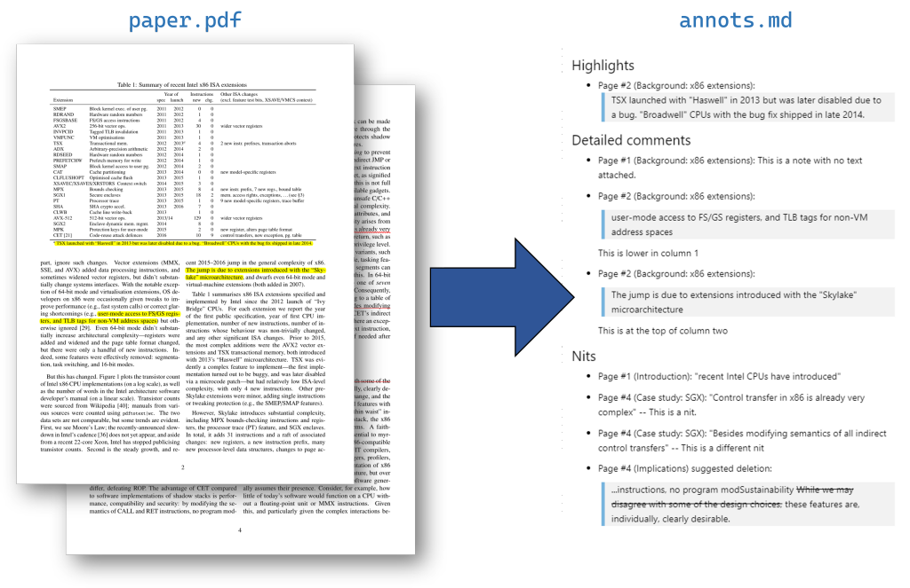

## pdfannots

This program extracts annotations (highlights, comments, etc.) from a PDF file,
and formats them as Markdown or exports them to JSON. It is primarily intended
for use in reviewing submissions to scientific conferences/journals.

For the default Markdown format, the output is as follows:

 * Highlights without an attached comment are output first, as
   "highlights" with just the highlighted text included. Note that
   these are not typically suitable for use in a review, since they're
   unlikely to have any meaning to the recipient; they are just meant
   to serve as a reminder to the reviewer.

 * Highlights with an attached comment, and text annotations (not
   attached to any particular text/highlight) are output next, as
   "detailed comments". Typically most comments on a reviewed paper
   are of this form.

 * Underline, strikeout, and squiggly underline annotations are output
   last, as "Nits", with or without an attached comment. The intention
   of this is to easily separate formatting or grammatical corrections
   from more substantial comments about the content of the document.

For each annotation, the page number is given, along with the associated
(highlighted/underlined) text, if any. Additionally, if the document embeds
outlines (aka bookmarks), such as those generated by the LaTeX
[hyperref](https://ctan.org/pkg/hyperref) package, they are printed to help
identify to which section in the document the annotation refers.

### Usage

See `pdfannots --help` (in a source tree: `pdfannots.py --help`) for
options and invocation.

### Dependencies

 * Python >= 3.7
 * [pdfminer.six](https://github.com/pdfminer/pdfminer.six)

### Known issues and limitations

 * While it is generally reliable, pdfminer (the underlying PDF parser) is
   not infallible at extracting text from a PDF. It has been known to fail
   in several different ways:

    * Sometimes it misses or misplaces individual characters, resulting in
      annotations with some or all of the text missing (in the latter case,
      you'll see a warning).

    * Sometimes the characters are captured, but not spaces between the words.
      Tweaking the advanced layout analysis parameters (e.g., `--word-margin`)
      may help with this.

    * Sometimes it extracts all the text but renders it out of order, for
      example, reporting that text at the top of a second column comes before
      text at the end of the first column. This causes pdfannots to return the
      annotations out of order, or to report the wrong outlines (section
      headings) for annotations. You can mostly work around this issue by using
      the `--cols` parameter to force a fixed page layout for the document
      (e.g. `--cols=2` for a typical 2-column document).

 * If an annotation (such as a StrikeOut) covers solely whitespace, no text is
   extracted for the annotation, and it will be skipped (with a warning). This
   is an artifact of the way pdfminer reports whitespace with only an implicit
   position defined by surrounding characters.

 * When extracting text, we remove all hyphens that immediately precede a line
   break and join the adjacent words. This usually produces the best results
   with LaTeX multi-column documents (e.g. "soft-`\n`ware" becomes "software"),
   but sometimes the hyphen needs to stay (e.g. "memory-`\n`mapped", which will be
   extracted as "memorymapped"), and we can't tell the difference. To disable
   this behaviour, pass `--keep-hyphens`.

### FAQ

 1. I'd like to change how the output is formatted.

    Some minor tweaks (e.g.: word wrap, skipping or reordering output sections)
    can be accomplished via command-line arguments.

    All of the output comes from the relevant `Printer` subclass; more elaborate
    changes can be accomplished there. Pull requests to introduce new output
    formats or variants as printers are welcomed.

 2. I think I got a review generated by this tool...

    I hope that it was a constructive review, and that the annotations
    helped the reviewer give you more detailed feedback so you can improve
    your paper. This is, after all, just a tool, and it should not be an
    excuse for reviewer sloppiness.
